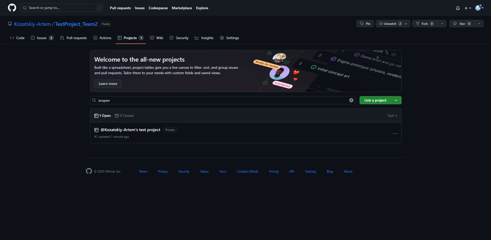
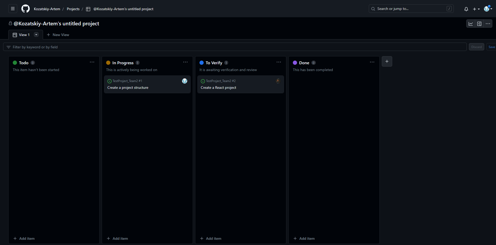

# How to work with repository
First, you need to clone the repository to your local machine by running the following command:
`git clone git@github.com:Kozatskiy-Artem/TestProject_Team2.git`

While working on the project, we will distribute tasks to each participant, the board in the repository will help us with this.
It is located in the projects tab on the repository page.

We will create a task (card) on the board, describe it and assign it to the participant. 
During the execution of the task, the card can be moved depending on the state.

It is desirable to create a new branch under each task, the name of which would make it clear what is happening there.
But you don't need to come up with too long titles, task cards and commit messages are for that
Examples:
`git checkout -b dev-user-api` or `git checkout -b dev-login-page`

After you pushed new branch to repository, you need to create pull request. 
To do it, you need to click on 'Pull requests' -> 'New pull request'.

You can review the changes made in the 'Files changed' tab to ensure everything looks good. 
After that you need to click on "Create pull request" as highlighted by the arrow. 
'Compare' should be your newly-created branch and 'base' should be 'dev'. 
The only branch from which we will be creating pull requests to 'main' will be the 'dev' branch.

Once you have reviewed and filled in the necessary information such as the name of pull request and description,
click on the 'Create pull request' button again to submit your pull request.
It will also be a good practice to assign another participant to do a code review when creating a pull request.

# Getting Started with Create React App

This project was bootstrapped with [Create React App](https://github.com/facebook/create-react-app).

## Available Scripts

In the project directory, you can run:

### `npm start`

Runs the app in the development mode.\
Open [http://localhost:3000](http://localhost:3000) to view it in your browser.

The page will reload when you make changes.\
You may also see any lint errors in the console.

### `npm test`

Launches the test runner in the interactive watch mode.\
See the section about [running tests](https://facebook.github.io/create-react-app/docs/running-tests) for more information.

### `npm run build`

Builds the app for production to the `build` folder.\
It correctly bundles React in production mode and optimizes the build for the best performance.

The build is minified and the filenames include the hashes.\
Your app is ready to be deployed!

See the section about [deployment](https://facebook.github.io/create-react-app/docs/deployment) for more information.

### `npm run eject`

**Note: this is a one-way operation. Once you `eject`, you can't go back!**

If you aren't satisfied with the build tool and configuration choices, you can `eject` at any time. This command will remove the single build dependency from your project.

Instead, it will copy all the configuration files and the transitive dependencies (webpack, Babel, ESLint, etc) right into your project so you have full control over them. All of the commands except `eject` will still work, but they will point to the copied scripts so you can tweak them. At this point you're on your own.

You don't have to ever use `eject`. The curated feature set is suitable for small and middle deployments, and you shouldn't feel obligated to use this feature. However we understand that this tool wouldn't be useful if you couldn't customize it when you are ready for it.

## Learn More

You can learn more in the [Create React App documentation](https://facebook.github.io/create-react-app/docs/getting-started).

To learn React, check out the [React documentation](https://reactjs.org/).

### Code Splitting

This section has moved here: [https://facebook.github.io/create-react-app/docs/code-splitting](https://facebook.github.io/create-react-app/docs/code-splitting)

### Analyzing the Bundle Size

This section has moved here: [https://facebook.github.io/create-react-app/docs/analyzing-the-bundle-size](https://facebook.github.io/create-react-app/docs/analyzing-the-bundle-size)

### Making a Progressive Web App

This section has moved here: [https://facebook.github.io/create-react-app/docs/making-a-progressive-web-app](https://facebook.github.io/create-react-app/docs/making-a-progressive-web-app)

### Advanced Configuration

This section has moved here: [https://facebook.github.io/create-react-app/docs/advanced-configuration](https://facebook.github.io/create-react-app/docs/advanced-configuration)

### Deployment

This section has moved here: [https://facebook.github.io/create-react-app/docs/deployment](https://facebook.github.io/create-react-app/docs/deployment)

### `npm run build` fails to minify

This section has moved here: [https://facebook.github.io/create-react-app/docs/troubleshooting#npm-run-build-fails-to-minify](https://facebook.github.io/create-react-app/docs/troubleshooting#npm-run-build-fails-to-minify)
